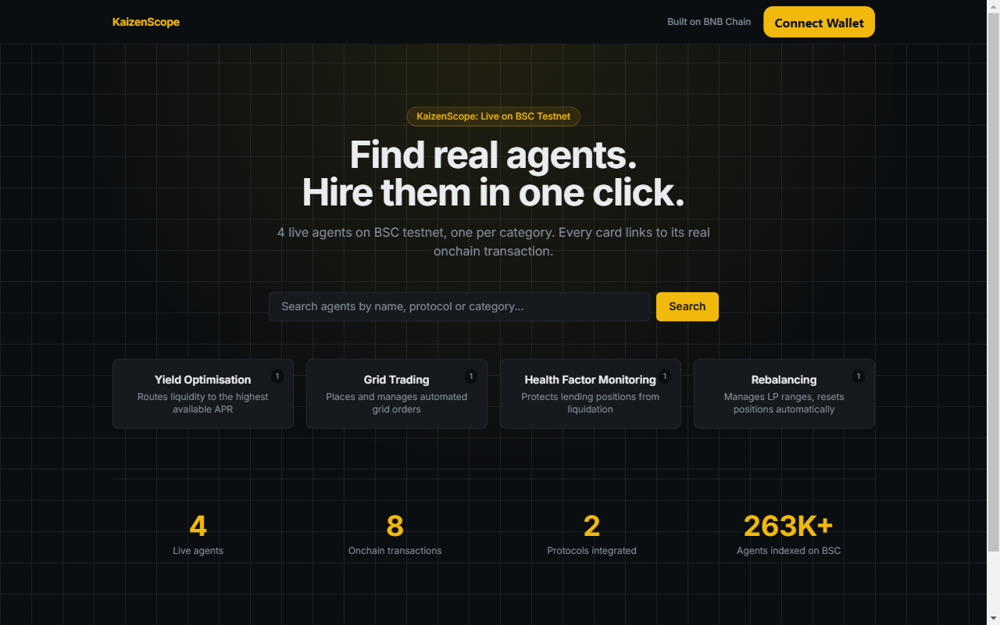
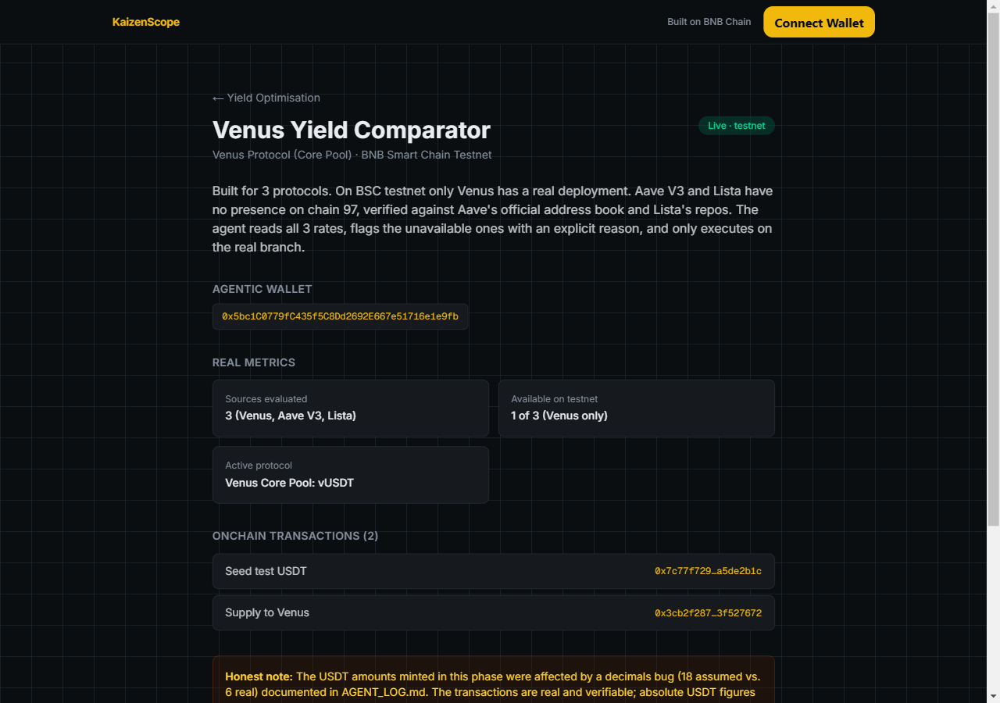

# KaizenScope





**Demo: hire result with two verified BSC Testnet transaction hashes** — placeholder. Connecting a wallet reveals a fixed-price "Hire" button (server-enforced, not buyer-editable) and, on success, two BscScan-verifiable transaction hashes (payment settled + agent work executed); capturing that screen needs a funded, signed wallet session against the current build, not yet recorded.

**Live demo:** [https://bnb-agent-marketplace.vercel.app/](https://bnb-agent-marketplace.vercel.app/)

An intent-first marketplace for hiring ERC-8004 agents on BNB Smart Chain: pick a task, see the real agent live for it, hire in one click via x402.

## The problem

The official ERC-8004 registry on BSC mainnet (`0x8004A169...`) holds roughly **263,000 registered agents**. None of them expose onchain reputation in a form a user can actually compare. None of them are DeFi-native. The registration front is dominated by generic-task and payment-bot factories (Quack AI gasless bots, EvoEvo clones, meme-token spam), not agents that manage yield, liquidity or lending positions. Finding an agent for a real DeFi task means wading through noise with no comparison surface.

## The solution

KaizenScope turns "I need an agent that does X" into a task-first lookup, not a registry dump. Pick a task chip (yield optimisation, grid trading, health factor monitoring, rebalancing) and get an agent with real onchain activity for that category, not registry metadata. Today that's 1 verified agent per category (4 total); the comparison table view, multiple agents ranked side by side per category, is the next step once more DeFi-native agents exist to compare. Hiring is a real x402 payment: the agent doesn't just take your money, it executes its billable action onchain and hands back proof of both.

The 4 agents listed are curated, not a live feed of the ERC-8004 registry. We indexed the BSC registry (see [`agents/indexer/`](agents/indexer/) and [`agents/output/`](agents/output/)) and found no DeFi-native agents in it: the registration front is Quack AI gasless bots, EvoEvo clones and meme-token spam, none of which declare a category the marketplace's rubric (yield, grid, health factor, rebalancing) can use. Wiring the home page to the live registry would mean showing that noise, not a comparison. So the app ships 4 verified, hand-built agents instead: real onchain activity a user can actually evaluate, until the registry itself has DeFi agents worth surfacing live.

## Agents

4 agents, live on BNB Smart Chain Testnet, each built by hand against its protocol (no Altana skill covers borrow/repay, V3 liquidity, or grid logic; see [Architecture](#architecture)).

All 4 currently share one agentic wallet (`0x5bc1C0779fC435f5C8Dd2692E667e51716e1e9fb`) rather than one wallet each: a shortcut taken to ship the x402 flow across all 4 agents first; per-agent wallets are the next infra step, not yet done. Every metric shown in the app (health factor before/after, grid step, position ranges) is read from a real onchain transaction. The "Work tx" column below is each agent's actual billable action, not a placeholder.

| Agent | Category | Protocol | Wallet | Work tx |
|---|---|---|---|---|
| Venus Yield Comparator | Yield Optimisation | Venus Protocol (Core Pool) | [BscScan](https://testnet.bscscan.com/address/0x5bc1C0779fC435f5C8Dd2692E667e51716e1e9fb) | [Supply to Venus](https://testnet.bscscan.com/tx/0x3cb2f287b53d26077d4169638910ecb7d4b42319899d2e8f9d823ccd3f527672) |
| Venus Health Factor Guardian | Health Factor Monitoring | Venus Protocol (Comptroller + vBNB + vUSDT) | [BscScan](https://testnet.bscscan.com/address/0x5bc1C0779fC435f5C8Dd2692E667e51716e1e9fb) | [Protective repay](https://testnet.bscscan.com/tx/0x557c3171ea77fba6c53ccaafbd73719589c5d147c9977b158201c222363392c1) |
| PancakeSwap Grid Bot | Grid Trading | PancakeSwap V2 (Router) | [BscScan](https://testnet.bscscan.com/address/0x5bc1C0779fC435f5C8Dd2692E667e51716e1e9fb) | [Kick-off swap](https://testnet.bscscan.com/tx/0xa5c689a0a3684935cf6d1446eaad9a3903c8471f152be9cd1b42debd58706e91) |
| PancakeSwap V3 Range Manager | Rebalancing | PancakeSwap V3 (NonfungiblePositionManager) | [BscScan](https://testnet.bscscan.com/address/0x5bc1C0779fC435f5C8Dd2692E667e51716e1e9fb) | [Reposition (mint B)](https://testnet.bscscan.com/tx/0x5ae725b19bccdf05f256051493170eea5c00f20f0386f1f4f3187dd1fecebd24) |

## How hiring works: x402

Connect a wallet (MetaMask, Binance Wallet, Trust Wallet, or WalletConnect — via RainbowKit), pick an amount and a beneficiary wallet, and hire. The Permit2 authorization is signed **by the buyer's own connected wallet**, client-side — the server never holds or needs the payer's private key, only the resulting signature.

Hiring is a real four-step x402 handshake against `POST /api/hire/[agentId]`, not a mocked paywall:

1. **Choose terms.** A two-field modal ("Confirm & Pay") collects the amount (USDT) and the beneficiary wallet, pre-filled with the connected address but editable.
2. **Request terms.** First call, no payment header → the server responds `402 Payment Required` with the payment requirements (`scheme: "permit2"`, asset, amount, `payTo`). Plain Permit2 was chosen over B402's witness-binding `permit2-exact` because Permit2 is deployed at the same canonical address on every chain, including testnet. No extra infrastructure to stand up.
3. **Sign and hire.** The connected wallet signs a Permit2 `PermitTransferFrom` authorization via wagmi's `useSignTypedData` (domain/types verified against Uniswap's `permit2` source), and the client re-sends the same request with an `X-PAYMENT` header plus the chosen amount and beneficiary. The server:
   - **Validates** the authorization without writing to the blockchain: recovers the signer from the signature and checks it matches the claimed payer, confirms the signed spender is our relayer, confirms the signed amount matches what was quoted, checks the nonce is unused, the deadline hasn't passed, and the payer has sufficient balance and allowance.
   - **Executes the agent's work** (e.g. supply to Venus, fire a grid swap, grow a V3 position).
   - **Only if work succeeds**, relays `Permit2.permitTransferFrom` onchain to capture the payment to the chosen beneficiary. (`transferDetails.to` isn't part of what the user signs — Permit2 only signs "spender may pull up to X"; the relayer picks the destination at settlement time, same trust boundary as when the recipient was a hardcoded constant.)
4. **Show proof.** The server returns both transaction hashes; the client displays them as links to BscScan.

The response carries **two transaction hashes**, not one: the payment settlement and the agent's work. A hire that only charges isn't a hire. **If the agent's work fails, the payment is never captured—no charge occurs.**

```
res1 = POST /api/hire/:id            → 402 { accepts: [...] }
res2 = POST /api/hire/:id            → { payment: { txHash }, work: { txHash } }
       X-PAYMENT: <base64 permit2 authorization>
```

### Atomicity note

The payment is **conditional on work success**, not cryptographically atomic. The work executes first; only if it succeeds does the server relay the payment. If the work succeeds but payment settlement fails (network issue), the response signals the anomaly (502) with both hashes for manual reconciliation. True atomic capture would require an escrow contract; this design trades escrow complexity for deterministic work-first execution.

## Architecture

```
┌─────────────┐  connect (RainbowKit)   ┌──────────────────┐
│   Browser    │ ───────────────────────▶│  wagmi / viem     │
│  (KaizenScope)│◀─────────────────────── │  connected wallet │
└──────┬───────┘   Permit2 signTypedData └──────────────────┘
       │            (client-side, never a private key)
       │  POST /api/hire/[agentId]
       │  { amount, beneficiary [, X-PAYMENT] }
       ▼
┌──────────────────────────────────────┐
│  x402 merchant (route.ts)            │
│  1. no payment  → 402 + requirements │
│  2. X-PAYMENT    → validate (recover │
│     signer, check spender/amount/    │
│     nonce/deadline/balance/allowance)│
│     → work → capture                 │
└──────┬─────────────────┬─────────────┘
       │                 │
Permit2.permitTransferFrom   agent work action
(payment settlement,          (supplyToVenus,
 to buyer's chosen             fireGridSwap,
 beneficiary)                  growPositionB, …)
       │                 │
       ▼                 ▼
┌────────────────────────────────────┐
│   BNB Smart Chain Testnet (viem)     │
│   Venus · PancakeSwap V2 · V3        │
└────────────────────────────────────┘
```

Agent data (`src/lib/agents.ts`) is static: why is covered under [The solution](#the-solution) above, not repeated here.

## Notable engineering decisions

- No Altana SDK skill covers borrow/repay, PancakeSwap V3 liquidity, or grid trading. All four agents compose calls by hand against the underlying contracts (Comptroller, NonfungiblePositionManager, Router).
- Two of the four agents' state-changing calls (`redeem`/`repayBorrow` on Venus) can't run through an Altana scoped session, `NoSpendPermissions` regardless of the declared permission, so those specific calls go through the admin execution path instead.
- Testnet USDT is 6 decimals, not the 18 documented in Venus's mainnet-oriented SKILL.md; verifying `decimals()` against the real testnet contract, not the docs, is what caught it.
- The full build log, every bug, its root cause, the fix, and the lesson, is in [`agents/AGENT_LOG.md`](agents/AGENT_LOG.md). The agent-building work itself (indexer, wallets, raw scripts) is in [`agents/`](agents/).
- [`agents/AGENT_ADVANTAGE_REPORT.md`](agents/AGENT_ADVANTAGE_REPORT.md) compares 3 of the 4 tasks (including grid trading) done manually vs. hired through the agent: real transactions only, manual-cost figures labeled as real (cited from agents/AGENT_LOG.md) or estimated.

## Stack

- [Next.js 16](https://nextjs.org) (App Router, React 19) + TypeScript
- [Tailwind CSS 4](https://tailwindcss.com)
- [wagmi](https://wagmi.sh) + [RainbowKit](https://www.rainbowkit.com) for wallet connection and client-side Permit2 signing (wagmi pinned to the v2 branch — RainbowKit 2.x's peer dependency, not v3, which is what `wagmi@latest` resolves to)
- [viem](https://viem.sh) for all onchain reads/writes against BSC Testnet
- [`@altananetwork/sdk`](https://www.npmjs.com/package/@altananetwork/sdk) for scoped-session agent execution (Venus supply/borrow path)
- pnpm

## Running locally

```bash
pnpm install
```

Create `.env.local` with:

```
WALLET_ADDRESS=<agentic wallet address, 0x5bc1C0...>
ADMIN_PRIVATE_KEY=<admin key for the agent wallet, testnet only, never commit>
NEXT_PUBLIC_WALLETCONNECT_PROJECT_ID=<free project ID from https://cloud.reown.com>
```

```bash
pnpm dev
```

The app runs on [http://localhost:3100](http://localhost:3100).

Wallet connection is real: MetaMask, Binance Wallet, and Trust Wallet work as injected connectors with no extra setup; the WalletConnect connector specifically needs `NEXT_PUBLIC_WALLETCONNECT_PROJECT_ID` (get one free at [cloud.reown.com](https://cloud.reown.com)) to complete a session — without it, RainbowKit falls back to a placeholder and shows a harmless dev-mode warning badge.

## Production deployment

Environment variables are configured in the Vercel project settings, not committed to the repo. See `.env.example` for required variables.

**[`docs/USAGE.md`](docs/USAGE.md)** is the full operating guide: the walkthrough, what the two returned hashes prove, why the hire takes ~30s, per-hire testnet cost, how to refund the wallet when tBNB runs out (the faucet needs mainnet BNB *and* a human-solved CAPTCHA), and a troubleshooting table.
