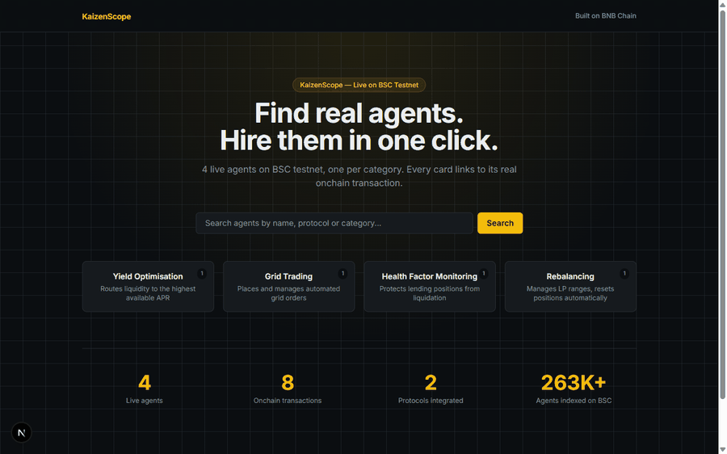

# KaizenScope

An intent-first marketplace for hiring ERC-8004 agents on BNB Smart Chain — pick a task, compare 3 comparable agents by onchain reputation, cost and liveness, hire in one click via x402.

<!-- TODO: demo GIF -->
<!--  -->

## The problem

The official ERC-8004 registry on BSC mainnet (`0x8004A169...`) holds roughly **263,000 registered agents**. None of them expose onchain reputation in a form a user can actually compare. None of them are DeFi-native — the registration front is dominated by generic-task and payment-bot factories (Quack AI gasless bots, EvoEvo clones, meme-token spam), not agents that manage yield, liquidity or lending positions. Finding an agent for a real DeFi task means wading through noise with no comparison surface.

## The solution

KaizenScope turns "I need an agent that does X" into a 3-agent comparison table, not a registry dump. Pick a task chip — yield optimisation, grid trading, health factor monitoring, rebalancing — and get agents with real onchain activity, not registry metadata. Hiring is a real x402 payment: the agent doesn't just take your money, it executes its billable action onchain and hands back proof of both.

## Agents

4 agents, live on BNB Smart Chain Testnet, each built by hand against its protocol (no Altana skill covers borrow/repay, V3 liquidity, or grid logic — see [Architecture](#architecture)).

| Agent | Category | Protocol | Wallet | Explorer |
|---|---|---|---|---|
| Venus Yield Comparator | Yield Optimisation | Venus Protocol (Core Pool) | `0x5bc1C0779fC435f5C8Dd2692E667e51716e1e9fb` | [BscScan](https://testnet.bscscan.com/address/0x5bc1C0779fC435f5C8Dd2692E667e51716e1e9fb) |
| Venus Health Factor Guardian | Health Factor Monitoring | Venus Protocol (Comptroller + vBNB + vUSDT) | `0x5bc1C0779fC435f5C8Dd2692E667e51716e1e9fb` | [BscScan](https://testnet.bscscan.com/address/0x5bc1C0779fC435f5C8Dd2692E667e51716e1e9fb) |
| PancakeSwap Grid Bot | Grid Trading | PancakeSwap V2 (Router) | `0x5bc1C0779fC435f5C8Dd2692E667e51716e1e9fb` | [BscScan](https://testnet.bscscan.com/address/0x5bc1C0779fC435f5C8Dd2692E667e51716e1e9fb) |
| PancakeSwap V3 Range Manager | Rebalancing | PancakeSwap V3 (NonfungiblePositionManager) | `0x5bc1C0779fC435f5C8Dd2692E667e51716e1e9fb` | [BscScan](https://testnet.bscscan.com/address/0x5bc1C0779fC435f5C8Dd2692E667e51716e1e9fb) |

All 4 share one agentic wallet. Every metric shown in the app (health factor before/after, grid step, position ranges) is read from a real onchain transaction — see each agent's detail page for the tx hashes.

## How hiring works: x402

Hiring is a real two-step x402 handshake against `POST /api/hire/[agentId]`, not a mocked paywall:

1. **Request terms.** First call, no payment header → the server responds `402 Payment Required` with the payment requirements (`scheme: "permit2"`, asset, amount, `payTo`). Plain Permit2 was chosen over B402's witness-binding `permit2-exact` because Permit2 is deployed at the same canonical address on every chain, including testnet — no extra infrastructure to stand up.
2. **Pay and settle.** The client signs a Permit2 `PermitTransferFrom` authorization and re-sends the same request with an `X-PAYMENT` header. The server decodes it, relays `Permit2.permitTransferFrom` onchain to settle the payment, then — only after settlement confirms — executes the agent's actual billable action (e.g. supply to Venus, fire a grid swap, grow a V3 position).

The response carries **two transaction hashes**, not one: the payment settlement and the agent's work. A hire that only charges isn't a hire.

```
res1 = POST /api/hire/:id            → 402 { accepts: [...] }
res2 = POST /api/hire/:id            → { payment: { txHash }, work: { txHash } }
       X-PAYMENT: <base64 permit2 authorization>
```

## Architecture

```
┌─────────────┐     task chip / search      ┌──────────────────┐
│   Browser    │ ───────────────────────────▶│  Next.js App     │
│  (KaizenScope)│◀─────────────────────────── │  Router (RSC)     │
└─────────────┘     agent comparison table    └──────┬───────────┘
                                                       │
                                       POST /api/hire/[agentId]
                                                       │
                                    ┌──────────────────▼──────────────────┐
                                    │  x402 merchant (route.ts)            │
                                    │  1. no payment  → 402 + requirements │
                                    │  2. X-PAYMENT    → settle + execute  │
                                    └──────┬─────────────────┬────────────┘
                                           │                 │
                              Permit2.permitTransferFrom   agent work action
                              (payment settlement)          (supplyToVenus,
                                           │                 fireGridSwap,
                                           ▼                 growPositionB, …)
                                ┌────────────────────────────────────┐
                                │   BNB Smart Chain Testnet (viem)     │
                                │   Venus · PancakeSwap V2 · V3        │
                                └────────────────────────────────────┘
```

Agent data (`src/lib/agents.ts`) is static and curated, not fetched live from the ERC-8004 registry — the indexer that sampled the 263K-agent registry lives in the sibling [`BNB-Hackaton`](https://github.com/kaizenbnb/BNB-Hackaton) repo and informed the category taxonomy, but this frontend ships with 4 verified, hand-built agents rather than a live feed of unclassified registrations. See [Notable engineering decisions](#notable-engineering-decisions) for why.

## Notable engineering decisions

- No Altana SDK skill covers borrow/repay, PancakeSwap V3 liquidity, or grid trading — all four agents compose calls by hand against the underlying contracts (Comptroller, NonfungiblePositionManager, Router).
- Two of the four agents' state-changing calls (`redeem`/`repayBorrow` on Venus) can't run through an Altana scoped session — `NoSpendPermissions` regardless of the declared permission — so those specific calls go through the admin execution path instead.
- Testnet USDT is 6 decimals, not the 18 documented in Venus's mainnet-oriented SKILL.md; verifying `decimals()` against the real testnet contract, not the docs, is what caught it.
- The full build log — every bug, its root cause, the fix, and the lesson — is in [`AGENT_LOG.md`](./AGENT_LOG.md). The agent-building work itself (indexer, wallets, raw scripts) happened in the sibling `BNB-Hackaton` repo; the log is copied here so the full story is in one place.

## Stack

- [Next.js 16](https://nextjs.org) (App Router, React 19, Server Actions) + TypeScript
- [Tailwind CSS 4](https://tailwindcss.com)
- [viem](https://viem.sh) for all onchain reads/writes against BSC Testnet
- [`@altananetwork/sdk`](https://www.npmjs.com/package/@altananetwork/sdk) for scoped-session agent execution (Venus supply/borrow path)
- pnpm

## Running locally

```bash
pnpm install
```

Create `.env.local` with:

```
WALLET_ADDRESS=<agentic wallet address, 0x5bc1C0...>
ADMIN_PRIVATE_KEY=<admin key for the agent wallet — testnet only, never commit>
X402_SESSION_SIGNER_KEY=<key used to sign the demo's Permit2 payment>
```

```bash
pnpm dev
```

The app runs on [http://localhost:3100](http://localhost:3100).

No wallet extension is wired up client-side — the demo signs the x402 Permit2 payment server-side via a Server Action, since there's no browser wallet connection in this build. See `src/app/actions/hire.ts`.
